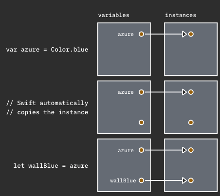
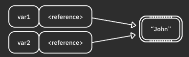

#Swift基础学习(一)


[TOC]

## 1.表达式
**注意事项** :  Swift是安全性强的语言，对类型的同一性要求高，Swift在进行表达式计算时必须同种类型计算，否则编译不通过。
**场景**: 
- 1.我们在做UI计算时有的时候经常遇到整型与浮点型的计算冲突，最好默认是浮点数计算
- 2.Swift表达式有限制可以a / b, a/b，但是不能a /b或者a/ b
- 3.累加、累减不能++或者—，只能+=、-=
## 2.变量与常量
常量修饰的类型一旦赋值就不能改变，变量修饰的成员是可变的
## 3.类型
**Swift基本类型**:Int,Double,Character,String,Tuples(由多个任何类型的值组成的数据的类型，应用场景:常用使用场景: 1.日期→年月日  2. IndexPath 3. 坐标等等)
类型问题注意事项:
- **CGFloat与Double**:在混编项目当中经常需要将CGFloat类型的数值和Double类型数值进行计算，经常会出现编译问题。
## 4.控制流程
**比较运算符 Bool**1.OC当中可以使用YES,NO,true,false.Swift当中只有true，false两种2.判断值类型是否相等使用==
**布尔运算符**:1.通过||和&&来进行布尔运算2.布尔值切换:toggle()
**if 语句**、**三元条件运算符**、**while循环**、等等与其他语言类似
 **For 循环 形式: for in  where**
基本形式 ：
```
1.for model in  [model] 

2. for i in 1 ... count 

3.for _ in 0..<count
\\ 如果使用不到i可直接写_
```
### Switch  Case , **部分匹配**

switch,case : 
- 1.默认使用方式
- 2.适合任意类型，如放入字符串switch "dog" {case "cat":break,case "dog":break} ,或者元组

```
let coordinates = (x: 3, y: 2, z: 5)

switch coordinates {
case (0, 0, 0): // 1
  print("Origin")
case (_, 0, 0): // 2
  print("On the x-axis.")
case (0, _, 0): // 3
  print("On the y-axis.")
case (0, 0, _): // 4
  print("On the z-axis.")
default:        // 5
  print("Somewhere in space")
}
```
-  3.多个case同一输出
-  4.where添加条件例如:switch number { case _ where number %2 == 0}类似于mysql当中where作用，条件判断,_是部分匹配的作用
## 5.函数
1. 默认按照这种格式去定义func name(b a : type) → returnType {} 解释:func代表当前定义一个函数 name:函数名 b:外部调用展示参数名 a:函数内部使用参数名称 type:参数类型 returnType返回值类型
2. 多态性:1. 参数提供默认值、2. 参数可以有多个、返回值类型不同->重载,3. 子类可以重写
3. 注意事项:1. 参数是常量，不能被修改 ,可以加上Inout，实现浅拷贝特性 

```jsx
func incrementAndPrint(_ value: inout Int) {
  value += 1
  print(value)
}
var value = 5
incrementAndPrint(&value) // 引用value
print为6
```
## 6.可选类型
在我们学习过程当中之前所使用的大部分常量或者变量都是有默认值的或者在初始化都是要给出默认值的，但在实际业务开发当中并不是所有场景都会对声明的变量或者常量提供默认值。
如以下几种情况: 
- 我们接收后端从来的网络请求数据然后展示界面信息，数据是json格式的，最终会把json格式的数据转换成本地类或结构体的模型作为数据的提供者，之后再把数据提供者的数据展示到当前屏幕上也就是来自数据库的一条条数据。如果我们一开始没有接收到数据，这时候不应该提供默认值的，因为展示的视图大部分情况下会根据数据进行渲染，如果给予默认值不好控制视图渲染。
-  我们在填写信息的时候有些数据是空的，但是我们并不能判断当前是否为空，如填写姓名、年龄和职业，姓名、年龄必填，职位选填等等
### 可选类型:
```jsx
var name: Type? → var errorCode: Int? // 表示当前变量要么为空nil要么为
```
### 可选解包:
```jsx
var result: Int? = 30
print(result)
```
### 强制解包:
```jsx
var unwrappedAuthorName = authorName!
print("Author is \(unwrappedAuthorName)")
// 感叹号代表认定authorName可选类型一定是有值的
```
### **if let 与if var**
推荐
```jsx
var authorName : String?
// authorName = "demo"
if let unwrappedAuthorName = authorName {
  print("Author is \(unwrappedAuthorName)")
} else {
  print("No author.")
}
/// 这种方式比较安全，解释一下: 如果anthorName是有值的，代码会打印Author is demo，如果为nil会打印No author.
```
### guard let
使用场景:有时您想检查一个条件，并且只有在条件为真时才继续执行函数，例如当您使用可选项时。想象一个从网络中获取一些数据的函数。如果网络关闭，该提取可能会失败。封装此行为的常用方法是使用可选项，如果获取成功，则它具有值，`nil`否则具有值。这时候使用guard let 
### ??
```jsx
var optionalInt: Int? = 2
var mustHaveResult = optionalInt ?? 0
如果当前可选类型为nil是会走?? 后面的值,可以参考三元运算的思想，不过语法不同
如果optionalInt当中结果为nil，则mustHaveResult,否则等于optionalInt
```
## 7.集合类型
### 数组

#### 基本操作:

1. 创建: let array = [1, 2, 3, 4]
2. 访问元素:操作array.isEmpty→判空;array.count获取数量;array.first获取第一个元素;array.last获取最后一个元素;下标访问array[0],检查是否存在某个元素:array.contains(1);
3. 修改数组:添加array.append；array += 1;插入:array.insert(1,at:0);删除元素:array.removeLast();更新数组array[0] = 2，移动数组 array.swapAt(1,3);排序array.sort()
4. 遍历数组: for in

#### 高级操作:
**常用**：
- map:map很多时候可以代替for循环的作用：如下
```
self.barColors.map { $0.cgColor }\\将获取每个颜色的cgColor数据
```
- filter
```
	 let resultArrayCopy = self.relaxArray?.filter{(relaxIndex) -> Bool in
      let relaxIndex : Int = relaxIndex["relax"] as? Int ?? 0
	  return relaxIndex > self.readyPlayerItem?.currentIndex ?? 0
	}
	//筛选出数组当中满足指定条件的数据并组装成新数组
```
### 字典

#### 基本操作:

1. 创建: let dic = ["a" : 1, "b" : 2],var dic : [String : Int] = [:],定义容量:dic.reserveCapacity(2)
2. 下标访问

```jsx
dic = ["a": 2, "b": 2, "c": 8, "d": 6]

print(namesAndScores["a"]!) // 2
```

1. 常见操作

```jsx
dic.isEmpty  //  false
dic.count    //  4
更新value
dic.updateValue("2",forKey : "a")
dic["1"] = 4
删除键值对
dic.removeValue(forKey:"a")
字典遍历
for (key,value) in dic {
}
or 
for key in dic.keys {
}
```


 Set与数组类似，但是无序、且不重复
 
## 8.闭包
**闭包**：应用场景:异步回调，将函数上下文封装起来，到指定位置调用
**闭包写法如下**:
```
typealias CallBack = (_ object : AnyObject) -> Void\\带一个object对象参数，无返回值闭包

typealias OperationCallBack = (_ boolValue : Bool) -> Void\\带一个bool参数，无返回值闭包

typealias SelectCallBack = () -> Void\\不带参数，无返回值闭包

typealias IntegerCallBack = (_ intValue : Int) -> Void\\带整形参数，无返回值闭包

typealias StringCallBack = (_ stringValue : NSString) -> Void\\带字符串参数，无返回值闭包
```
我们在闭包当中一般都是写Void无返回值类型的闭包，因为如果带返回值有点套娃内味。可以理解为我从一个类里面返回一个异步闭包出去给别的类调用，别的类调用完之后又给当前类返回一个值，有点套娃。
@escaping:逃逸闭包:使用场景：在异步处理时很多时候不知道返回时间点，被标记成@escaping的闭包可以在函数返回后调用，它存储的变量会定义在方法外不会因为对象被释放掉了所以变量消失。
简单说一个业务场景:移动端很多时候在网络请求后会刷新数据，但是我们不知道数据什么时候接收到，假如出现网络延迟情况，在数据没有请求到时用户直接退出当前界面，那么当前界面被释放掉了，在这之后网络数据请求回来，但是对象被释放掉了，此时闭包当中捕获的值也被释放掉了会引起crash，所以@escaping修饰的闭包会延迟捕获参数的释放，保护了闭包内部的安全性。
## 9.属性
与其他面向对象语言里面的属性类似
## 10.枚举
### 与OC枚举的区别
1. 可以没有类型的枚举，OC一般定义整型枚举
2. 可以多种类型如Int、String

```jsx
enum month {
}
```

1. 遍历枚举情况

```jsx
enum pet : CaseIterable {
case cat, dog, bird, turtle, fish, hamster
}// 需要继承CaseIterable
for pet in Pet.allCases {
  print(pet)
}
```
## 11.iOS内存管理
### 堆与堆栈
- iOS当中主要有五大内存区域，我们主要讨论栈与堆栈：
堆栈区主要存值类型的数据结构，包括枚举、结构体、基本数据类型等等，他的特点是系统自动处理，当当前属性局部变量不需要使用时系统会自动释放，并且在创建的时候如结构体： let azure = Struct()就会在栈中创建一个结构体，let wallBlue = azure，会创建一个新的结构体。

堆区主要存引用类型的实例变量,如创建一个实例类a let a = ClassA() ,let b = a;两个实例变量会引用同一块堆区间，然后当前类引用计数+1.当当前对象的引用计数为0时，释放该对象。

## 13.结构体与类
结构体为值类型，类是引用类型，两种不同的类型，存储在不同的内存区域也有不同的特点，应用场景也相继不一样。
先说说特点:
结构体与类的区别:1. 结构体是不可变对象，它内部声明的值类型属性是不可变的。2.结构体当中没有面向对象当中的特性3.结构体没有循环引用的问题4.结构体在堆栈当中比在类快一些
## 14.循环引用与weak
引用类型的对象会有循环引用问题，当两个对象相互持有时会出现无法释放的情况，常见在类当中有闭包属性，并且闭包当中强引用当前类会造成循环引用。内部具体过程是	：进入闭包之后调用当前类类的引用计数+1，当闭包执行完成之后类引用计数不为零，没有释放掉，当前闭包也无法释放。这时候引入weak字段，被weak修饰的属性不会引起引用计数+1，所以当当前属性引用计数为零时则释放当前对象。